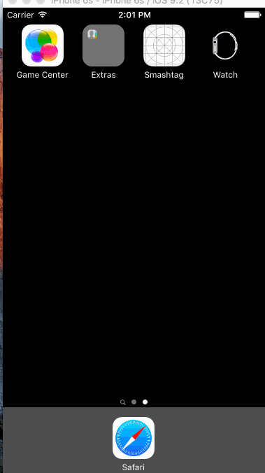

# Smashtag Demo
This demo basically shows how to use TableView to display data you get from Twitter.  The Twitter folder filled with Twitter-specific API wrappers are given (though the original version is only compatible with Swift 1.2).

## Summary
  * Can think of TableViewController as a list that holds a bunch of TableViewCell objects.
  * Each `TableViewCell` can have its own customized View.  In this example it is just the `TweetTableViewCell` which subclasses `TableViewCell`
  * Each TableViewCell instance would then have their own items.  In this case, each Cell (or an entry in the list) has their own picture, user screenname, and their tweet.
  * Requests to the web are async APIs, so be sure to call a `dispatch_async(dispatch_get_main_queue) {}` to get back on the UI queue.
  * The `TableViewController` can set a spinner easily by default in the storyboard.  Just adjust the "Refreshing" to "Enabled" in the dropdown and you automatically get a Refresh Control.
  * `textFieldShouldReturn` is a conforms to UITextFieldDelegate, which basically says if you press "enter" on the keyboard, what ought to happen.  In this case, we should hide the keyboard otherwise it'll be stuck there forever.
  * iOS needs a little bit of guidance for how tall to make each tweet.  In order to not have them all be the same height, you could just recommend a height but ultimately defer the height to iOS, this is done in this code snippet:

```swift
        tableView.estimatedRowHeight = tableView.rowHeight
        tableView.rowHeight = UITableViewAutomaticDimension
```

## Important Note(s)
1. The Twitter folder has been hacked to obey Swift 2.0; the current cs 193 course does not support Swift 2.0.

2. This might or might not have been introduced in Swift 2.0, but you cannot display the Twitter images properly due to security reasons.  
    In order to display the images, you need to lower the security in info.plist (just like in Cassini) by appending the following:  
```xml
        <key>NSAppTransportSecurity</key>
        <dict>
            <key>NSAllowsArbitraryLoads</key><true/>
        </dict>
```

3. There was something else, but I forget...

## Demo
Sorry for the morbid hashtag, it was just what is trending right now so I can demo the refresh feature.  

